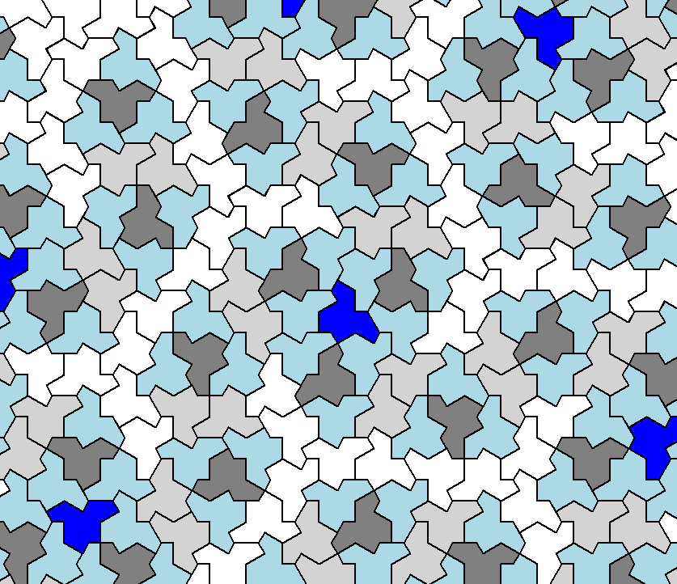

# Einstein Tile Generator

## What it is
The Einstein Tile was the most significant mathematical discovery of 2022. This tile is an aperiodic monotile that can cover an infinite plane without repeating. However, this doesn’t mean that if you zoom into a specific portion of the pattern, it will be unique, because large portions of the pattern repeat. An aperiodic pattern means that if you move the entire pattern on top of itself, it will never align with itself except for in the center. This  program is a Python implementation of an Einstein tile generator.

## How to run it
The files needed to run the pattern generator are `geometry.py` which contains different functions for matrix transformations, `graphics_tk.py` which draws the pattern, `pattern_generator.py` which contains the algorithm for generating the pattern, and `main.py` which runs the program. The only libraries which you need to have installed are "math" which comes preinstalled with python and "tkinter" which can be installed by running:

`pip install tk` 

Then to launch the program run `main.py` using: 

`python3 main.py` 

This will open a window with the first generation of the pattern. To move to the next generation just close the window and a new window will pop up with the next generation of the pattern. To change the scale of the pattern or the size of the window you can change the setting in the "draw_tiles" function in `main.py`.

## Seed to Pattern Generation
This part of the program is able to generate an image from the pattern based on a seed. Each seed corresponds to a unique coordinate on the x-y plane and when I give the program a seed it zooms into that coordinate and outputs the image that it zoomed into. The algorithm that converts the seed to a coordinate is in the `seed_to_pattern.py` file. The seeds go in a spiral, starting from the top right and going clockwise increasing the layer every loop. This means that for each seed you will get a unique part of the pattern. But since this is an aperiodic pattern that does not mean that each image will be unique because parts of the pattern do repeat.

To run this you need the files `pattern_generator.py`, `geometry.py`, `graphics_cv2.py`, and `seed_to_pattern.py`. To launch the program run `seed_to_pattern.py` using: 

`python3 seed_to_pattern.py` 

You can specify the seed to generate at the bottom of the program in the function "seed_to_pattern". The program will output the image as a file in the same directory that it is in.

## Credits
Thank you to Mar Gonzalez-Franco, Eric Gonzalez, and Karan Ahuja from Google Reasearch for helping me with this project and for their guidance.

My work was based on this paper: [An aperiodic monotile](https://cs.uwaterloo.ca/~csk/hat/) by David Smith, Joseph Samuel Myers, Craig S. Kaplan, and Chaim Goodman-Strauss.

Citation: Smith D., Myers J., Kaplan C., & Goodman-Strauss C. (2023). An aperiodic monotile. arXiv preprint arXiv:2303.10798.
